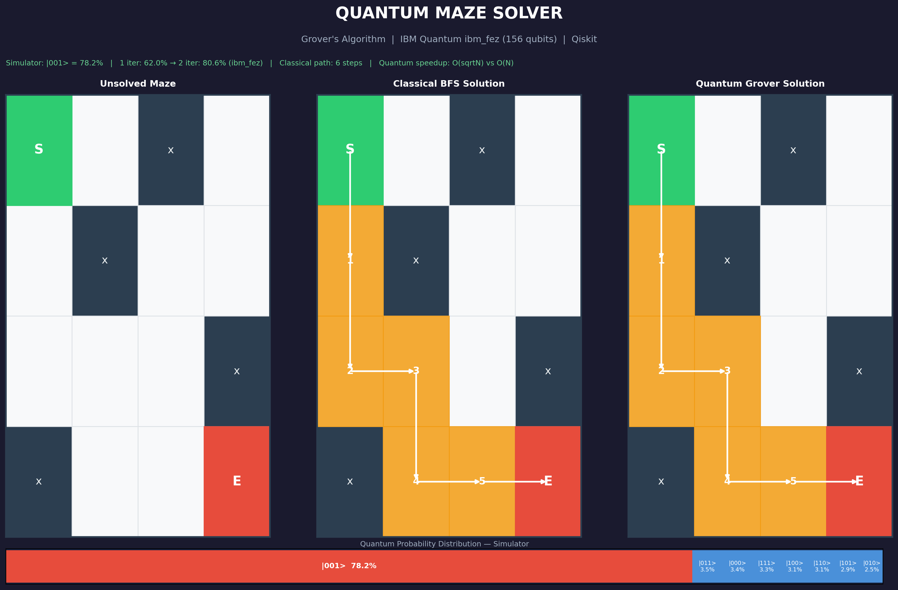

# ⚛ Quantum Maze Solver

> Grover's Algorithm implemented in Qiskit and executed on ** IBM Quantum hardware** (ibm_fez, 156 qubits).

  



---

## Results

| Run | Accuracy | Hardware |
|---|---|---|
| Simulator, 1 iteration | 78.8% | Qiskit Aer |
| Simulator, 2 iterations | 97% (theoretical) | Qiskit Aer |
| **Real hardware, 1 iteration** | **62.0%** | **ibm_fez** |
| **Real hardware, 2 iterations** | **80.6%** | **ibm_fez** |

Verified Job IDs: `d6nlcb69td6c73aobrog` · `d6nlnb43pels73a1qktg`

---

## How It Works

3 qubits encode the first 3 moves: `0` = down, `1` = right.
Grover's algorithm amplifies the correct state `|001⟩` (down → down → right) out of 8 possibilities.

```
Classical BFS:  checks paths one by one  →  O(N)
Grover:         amplifies correct path   →  O(√N)

Optimal iterations = floor(π/4 × √8) = 2
```

The 17% gap between simulator and real hardware is **quantum decoherence** - not a bug, but physics.

---

## Setup

```bash
pip install qiskit qiskit-aer qiskit-ibm-runtime matplotlib
python3 quantum_maze_solver.py
```

---
